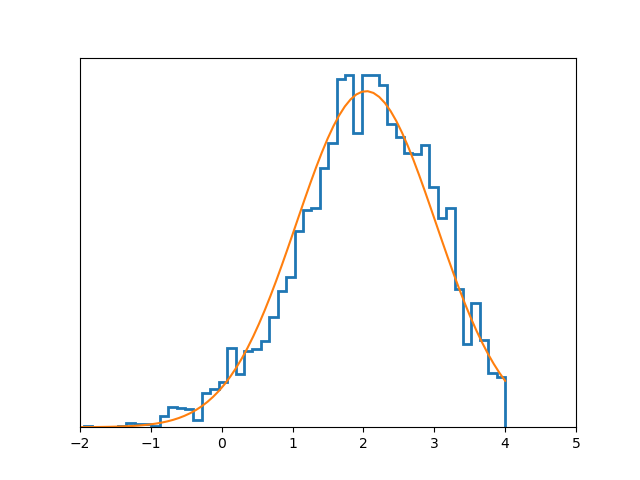
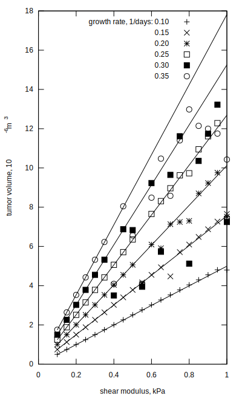
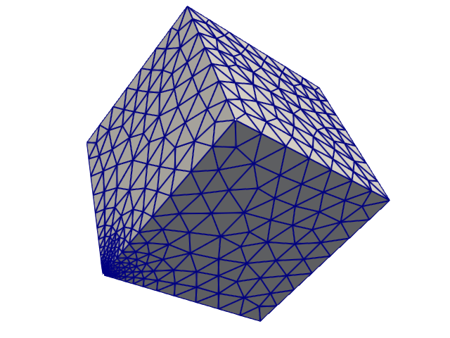

<p align="center"></p>

## Getting started
To run Msolve and
[korali](https://www.cse-lab.ethz.ch/korali)
integration example use the
[docker image](Dockerfile),
```
$ docker build github.com/DComEX/dcomex-prototype --tag dcomex
$ docker run -it dcomex bash
```
inside the container run
```
$ cd /src/tests/units
$ ./run.sh
$ cd /src/tests/validation/inference_heat/
$ OMP_NUM_THREADS=1 ./run_inference.py --num-cores 12 --num-samples 200
```

To run one Msolve simulation
```
$ bio 1 2 3
1.0851841319006034E-05
$ bio -h
Usage: bio [-v] [-c] [-s] k1 mu time

MSolve simulation of tumor growth.

Positional arguments:
  k1                   The growth rate of the tumor, in units of 1/second.
  mu                   The shear modulus of the tumor, in units of kPa.
  time                 The timestep to use in the simulation, in units of days.

Options:
  -v                   Print verbose output during the simulation.
  -c                   Output the MSolve configuration file and exit.
  -s                   Use a surrogate instead of the full simulation.
  -h                   Display this help message and exit.
Environment Variables:

  mph                  The path to the mesh of the simulated domain,
		       in .mph format.
Returns:
  The volume of the tumor, in units of cubic millimeters.
```

The online documentation is at
[ReadTheDocs](https://dcomex-framework-prototype.readthedocs.io/en/latest).

## Install as unprivileged user

Install korali, integration tools, and Msolve application

```
$ make 'USER = 1' 'PREFIX = $(HOME)/.local' lkorali
$ make 'USER = 1' 'PREFIX = $(HOME)/.local' lbin lib
$ make 'USER = 1' 'PREFIX = $(HOME)/.local' lmsolve
```

Run examples
```
$ python examples/graph/korali0.py
log evidence:  -2.490052761730272
1.0851841319006034E-05
$ bio -v 1 2 3
1.0851841319006034E-05
$ python examples/graph/analitical.py
graph.metropolis: accept = 0.724
graph.metropolis: accept = 0.684
graph.metropolis: accept = 0.7068
```

Open analitical.vis.png file
<p align="center"></p>

## Running on [Piz Daint](https://www.cscs.ch/computers/piz-daint)

To replicate CI runs manually it is possible to pull the containers by
logging in to Piz Daint and execute the commands

```
$ module load sarus
$ sarus pull IMAGE_NAME
$ srun --pty -C gpu -A GROUP_ID -N1 -n1 sarus run --mpi --tty IMAGE_NAME bash
```
This will drop you to a shell on the compute node inside the
container. From there you can replicate running the commands as in
`ci/prototype.yml`.  It is important to make sure that the container
image names match the naming `*/public/*`, i.e.  they must reside in a
directory named public, only then anonymous access is possible.

## Directory structure

* [bin](bin): integration utilities
* [CI](ci): definition of containerised build, test and deployment
  pipelines via CI/CD at CSCS
* [docs](docs): the source of the documentation
* [examples](examples): tutorials and examples
* [graph.py](graph.py): sample Bayesian graphs
* [follow.py](follow.py): trace function evalution and detect loops
* [kahan.py](kahan.py): Kahan summation or compensated summation algorithms
* [korali](korali): a directory to build korali
* [tests](tests): unit and integration tests

Application

* [msolve](msolve): Msolve application
* [integration](integration): integration of Msolve and korali

## Results
<p align="center"></p>
<p align="center"></p>

