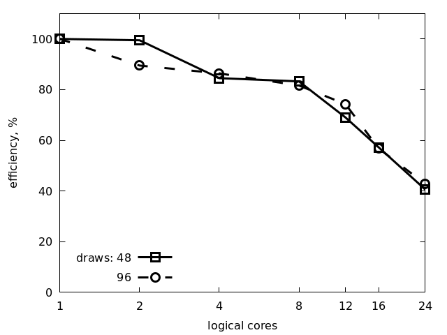
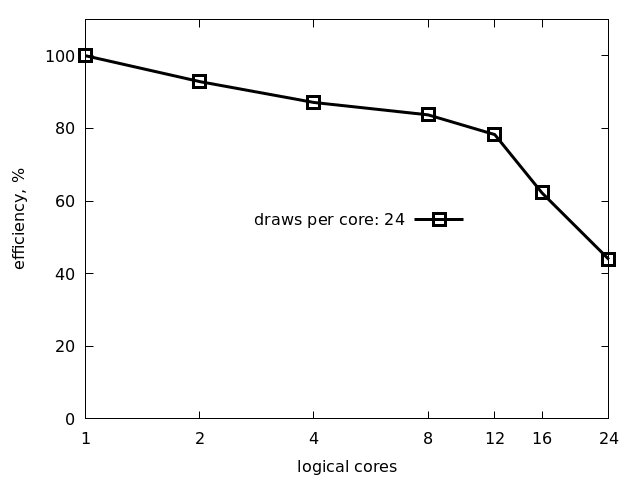

# One node scaling efficency

We assume that the tumor volume on day $1$ is $V_0$, and we want to
sample the parameters $k_1$ and $\mu$ based on the likelihood function
$N(V_{\text{mosolve}} - V_0,, \sigma = 1/2)$. Here, $N$ denotes the
normal distribution and $\sigma$ is the standard deviation. We use the
TMCMC algorithm with the default settings in Korali.

For strong scaling, we fix the total number of draws to be 48 and vary
the number of logical ranks from 1 to 24. The code used for this
experiment is shown below:

```
for n in 1 2 4 8 12 16 24; do python3 bio0.py -d 48 -n $n; done
```

<p align="center"></p>

For weak scaling, we fix the number of draws per logical rank to be 24
and increase the total number of logical ranks:

```
for n in 1 2 4 8 12 16 24
do d=`echo $n | awk '{print 24 * $n}'`
   python3 bio0.py -d $d -n $n; done
```

<p align="center"></p>

# Multi node scaling efficency

```
i='jfrog.svc.cscs.ch/contbuild/testing/anfink/3810120997072523/public/dcomex-framework:08fe8d6c'
module load sarus
sarus pull $i
```

```
i='jfrog.svc.cscs.ch/contbuild/testing/anfink/3810120997072523/public/dcomex-framework:08fe8d6c'
for n in 2 4 8 16 32 64 128 256 512 1024 2048 4096
do d=`echo $n | awk '{print 24 * $n}'`
      sbatch -J $n -o out.$n.log -e err.$n.log -t 15 --hint=nomultithread -C gpu -A d124 --exclusive -n $n --wrap='srun sarus run --mpi '$i' python3 /src/examples/benchmarks/bio1.py -d '$d' -v -s
      break
done
```
