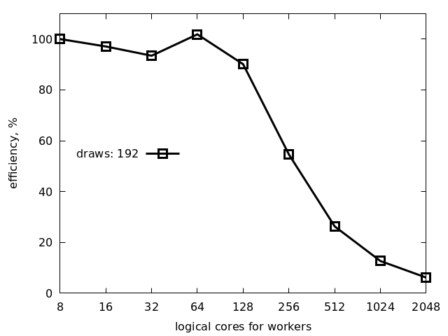

# Benchamrking

We conducted a performance analysis of the MSolve simulation using the
DComEx framework powered by Korali on the Piz Daint
supercomputer. This benchmark problem isBayesian inference of kinetic
parameters in a tumor growth model. The simulation aimed to estimate
the growth rate parameter ($k_1$) and shear modulus parameter ($\mu$)
based on a likelihood function,
$\mathcal{N}(V_{\text{mosolve}} - V_0,\,  \sigma = 1/2)$,
where $\mathcal{N}$ represents the normal distribution
and $\sigma$ is the standard deviation. We employed the TMCMC
algorithm with default settings in Korali. The simulation utilized the
MSolve-Bio application to solve a three-dimensional tumor growth
model.

## One node scaling efficency

For strong scaling analysis, we fix the total number of draws to 48
and vary the number of logical ranks from 1 to 24. The following code
snippet was used for this experiment:

```
for n in 1 2 4 8 12 16 24; do python3 bio0.py -d 48 -n $n; done
```

<p align="center"></p>

For weak scaling, we fix the number of draws per logical rank to be 24
and increase the total number of logical ranks:

```
for n in 1 2 4 8 12 16 24
do d=`echo $n | awk '{print 24 * $n}'`
   python3 bio0.py -d $d -n $n; done
```

<p align="center"></p>

## Multi node scaling efficency


To evaluate multi-node scaling efficiency, we set '--cpus-per-task 2'
flag to assign each logical rank to a physical processor core. For the
weak scaling analysis, we allocated one rank for the controller and
used 'n' workers. The following code snippet demonstrates the process:


```
$ cat msolve/run
i='jfrog.svc.cscs.ch/contbuild/testing/anfink/3810120997072523/public/dcomex-framework:08fe8d6c'
module load sarus
sarus pull $i
for m in 1 2 4 8 16 32 64 128 256 512 1024 2048
do d=$((24*m))
   n=$((m+1))
   srun -J $n.msolve -o out.$n.log -e err.$n.log -C gpu --cpus-per-task 2 -A d124 -n $n \
      sarus run --mpi $i \
      python3 /src/examples/benchmarks/bio1.py -d $d
done
```

In this plot, the x-axis represents the total number of logical ranks,
and the y-axis represents the scaling efficiency. By increasing the
number of ranks while maintaining a fixed workload per rank, we assess
the efficiency of scaling across multiple nodes.

<p align="center"></p>

For the strong scaling analysis, we used rank numbers starting from 8
and performed experiments with 192 draws. The code snippet used was
similar to the previous one, with appropriate modifications.

<p align="center"></p>


# Appendix


```
$ ssh daint srun -C gpu -A d124 -n 1 lscpu
Architecture:        x86_64
CPU op-mode(s):      32-bit, 64-bit
Byte Order:          Little Endian
Address sizes:       46 bits physical, 48 bits virtual
CPU(s):              24
On-line CPU(s) list: 0-23
Thread(s) per core:  2
Core(s) per socket:  12
Socket(s):           1
NUMA node(s):        1
Vendor ID:           GenuineIntel
CPU family:          6
Model:               63
Model name:          Intel(R) Xeon(R) CPU E5-2690 v3 @ 2.60GHz
Stepping:            2
CPU MHz:             3110.175
CPU max MHz:         2601.0000
CPU min MHz:         1200.0000
BogoMIPS:            5200.30
Virtualization:      VT-x
L1d cache:           32K
L1i cache:           32K
L2 cache:            256K
L3 cache:            30720K
NUMA node0 CPU(s):   0-23
```
