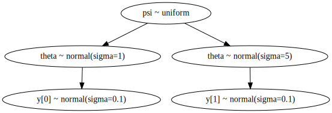
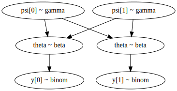
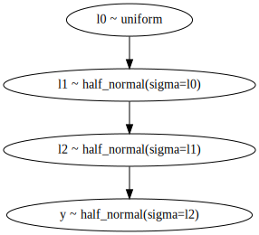
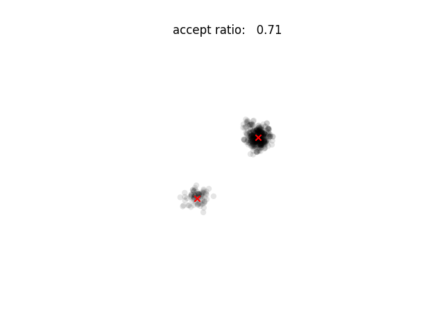
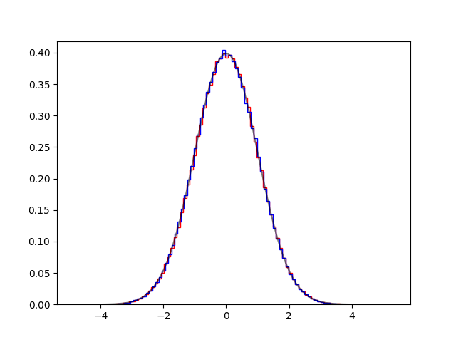
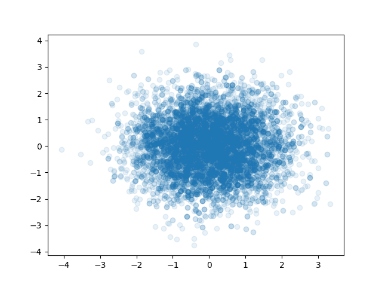
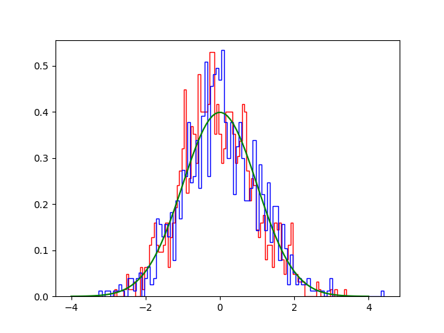
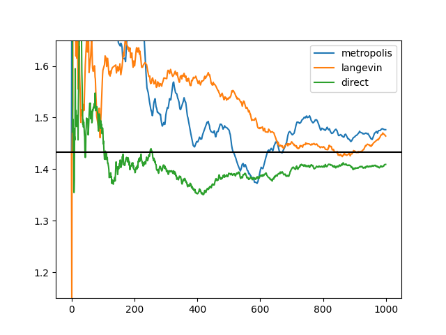

<h1>Examples</h1>

[analitical.py](analitical.py)

[coins.py](coins.py)

[three.py](three.py)

[tmcmc0.py](tmcmc0.py) 
[tmcmc1.py](tmcmc1.py) 
[tmcmc2.py](tmcmc2.py) 

[langevin0.py](langevin0.py) 

[langevin1.py](langevin1.py) 

[langevin2.py](langevin2.py) 

[langevin3.py](langevin3.py) 
[langevin4.py](langevin4.py) 

